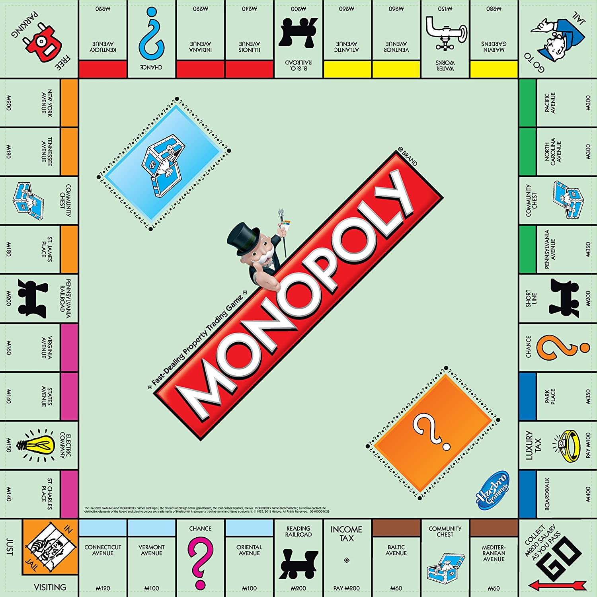

<h1> MonopolyProbabilities</h1>

<h1> Welcome to monopoly breaker!! </h1>
  
 
    Are you tired of losing to your younger siblings :smiling_imp: and your closest friends :anger:,
    Do not worry!!  :robot: With this "calculator" you will be able to see the probabilities of
    landing on each street.  But wait that means.....:bomb:   Yes you will know in full detail which color blocks are the
    mathematically correct ones to choose in order to maximize your probability of winning!! :exploding_head:
    
  

  
 Finished probability calculation for each square on the board!!  Here is the table  
   <table style="width:100px; border: 1px solid black">
    <tr>
        <td>Number</td>
        <td>Square Name</td>
        <td>Probability of Visiting</td>
    </tr>
    <tr>
        <td>0</td>
        <td>Jail / Just Visiting</td>
        <td>0.058376941</td>
    </tr>
    <tr>
        <td>1</td>
        <td>Free Parking</td>
        <td>0.030724196</td>
    </tr>
    <tr>
        <td>2</td>
        <td>Electric Company</td>
        <td>0.030235309</td>
    </tr>
    <tr>
        <td>3</td>
        <td>Tennessee Avenue</td>
        <td>0.029482473</td>
    </tr>
    <tr>
        <td>4</td>
        <td>Go</td>
        <td>0.028675415</td>
    </tr>
    <tr>
        <td>5</td>
        <td>Water Works</td>
        <td>0.028484257</td>
    </tr>
    <tr>
        <td>6</td>
        <td>Illinois Avenue</td>
        <td>0.028422126</td>
    </tr>
    <tr>
        <td>7</td>
        <td>B. &amp; O. Railroad</td>
        <td>0.028240886</td>
    </tr>
    <tr>
        <td>8</td>
        <td>Virginia Avenue</td>
        <td>0.028214249</td>
    </tr>
    <tr>
        <td>9</td>
        <td>Reading Railroad</td>
        <td>0.028209587</td>
    </tr>
    <tr>
        <td>10</td>
        <td>St. James Place</td>
        <td>0.02756319</td>
    </tr>
    <tr>
        <td>11</td>
        <td>Go To Jail</td>
        <td>0.025282488</td>
    </tr>
    <tr>
        <td>12</td>
        <td>Marvin Gardens</td>
        <td>0.02525697</td>
    </tr>
    <tr>
        <td>13</td>
        <td>St. Charles Place</td>
        <td>0.025251207</td>
    </tr>
    <tr>
        <td>14</td>
        <td>Ventnor Avenue</td>
        <td>0.024970755</td>
    </tr>
    <tr>
        <td>15</td>
        <td>Atlantic Avenue</td>
        <td>0.024767966</td>
    </tr>
    <tr>
        <td>16</td>
        <td>Boardwalk</td>
        <td>0.024472247</td>
    </tr>
    <tr>
        <td>17</td>
        <td>Pacific Avenue</td>
        <td>0.024431092</td>
    </tr>
    <tr>
        <td>18</td>
        <td>Community Chest</td>
        <td>0.023971607</td>
    </tr>
    <tr>
        <td>19</td>
        <td>North Carolina Avenue</td>
        <td>0.023450825</td>
    </tr>
    <tr>
        <td>20</td>
        <td>Indiana Avenue</td>
        <td>0.023320443</td>
    </tr>
    <tr>
        <td>21</td>
        <td>Short Line</td>
        <td>0.023153739</td>
    </tr>
    <tr>
        <td>22</td>
        <td>New York Avenue</td>
        <td>0.023038563</td>
    </tr>
    <tr>
        <td>23</td>
        <td>Kentucky Avenue</td>
        <td>0.022296092</td>
    </tr>
    <tr>
        <td>24</td>
        <td>Income Tax</td>
        <td>0.022044101</td>
    </tr>
    <tr>
        <td>25</td>
        <td>Pennsylvania Avenue</td>
        <td>0.021770678</td>
    </tr>
    <tr>
        <td>26</td>
        <td>Oriental Avenue</td>
        <td>0.021320539</td>
    </tr>
    <tr>
        <td>27</td>
        <td>Connecticut Avenue</td>
        <td>0.021266936</td>
    </tr>
    <tr>
        <td>28</td>
        <td>Vermont Avenue</td>
        <td>0.021210363</td>
    </tr>
    <tr>
        <td>29</td>
        <td>Baltic Avenue</td>
        <td>0.020616258</td>
    </tr>
    <tr>
        <td>30</td>
        <td>Mediterranean Avenue</td>
        <td>0.020304514</td>
    </tr>
    <tr>
        <td>31</td>
        <td>Luxury Tax</td>
        <td>0.019817593</td>
    </tr>
    <tr>
        <td>32</td>
        <td>Park Place</td>
        <td>0.019666825</td>
    </tr>
    <tr>
        <td>33</td>
        <td>States Avenue</td>
        <td>0.019633762</td>
    </tr>
    <tr>
        <td>34</td>
        <td>Chance</td>
        <td>0.019509221</td>
    </tr>
    <tr>
        <td>35</td>
        <td>Pennsylvania Railroad</td>
        <td>0.018840541</td>
    </tr>
</table>

  
  <h2>
    Adding more than just probabilities
  </h2>
  
 
    I am thinking of adding extras such as: <ul>
    <li>
     money managment
    </li>
    <li>
      based on how much money you have and what squares you own(as well as if you have houses/hotels)
      and what your competitors own, how much likely is it for you to win
    </li>
    
  

